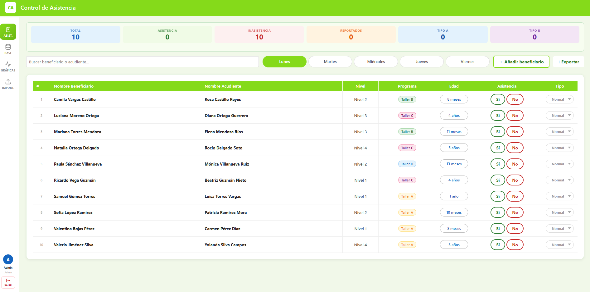
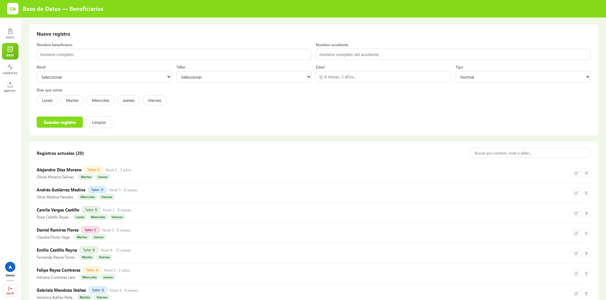
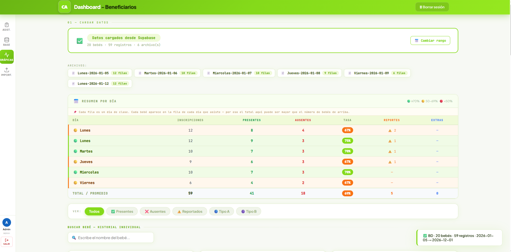
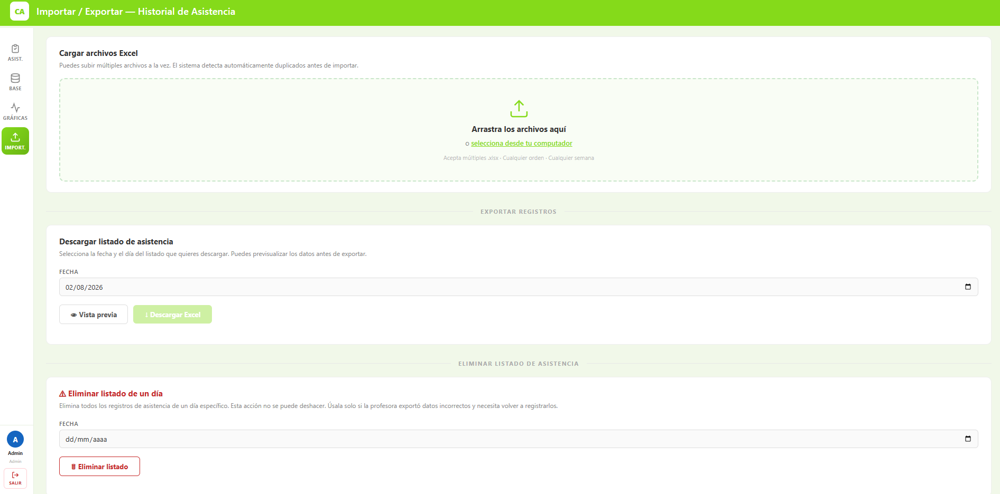

# Sistema de Control de Asistencia

Aplicación web full-stack para gestionar el registro diario de asistencia de beneficiarios en programas comunitarios/educativos: control por día de la semana, catálogo de beneficiarios, importación/exportación masiva de Excel, y un dashboard analítico con KPIs, gráficas y alertas de riesgo por baja asistencia.

Construido originalmente durante una práctica profesional y luego **generalizado como proyecto de portafolio**, removiendo referencias a la organización original y dejando el sistema listo para adaptarse a cualquier programa (fundación, guardería, taller, curso, etc.).

**🔗 Demo en vivo:** [sistema-control-de-asistencias.onrender.com](https://sistema-control-de-asistencias.onrender.com)

> ⚠️ El hosting es gratuito (Render free tier), así que el primer request puede tardar ~30-50s en despertar el servidor.

---

## Usuarios de demo

| Rol | Correo | Contraseña |
|---|---|---|
| Administrador | `admin@demo.com` | `Demo1234!` |
| Coordinadora | `coordinadora@demo.com` | `Demo1234!` |
| Profesora | `profesora@demo.com` | `Demo1234!` |

Cada rol ve un menú y permisos distintos (ver [Roles y permisos](#roles-y-permisos)).

---

## Capturas de pantalla

| Listado de asistencia | Base de Datos |
|---|---|
|  |  |

| Dashboard | Importar / Exportar |
|---|---|
|  |  |

---

## Características

- **Autenticación por roles** (admin / coordinadora / profesora) con Supabase Auth + Row Level Security
- **Registro de asistencia diario** por día de la semana (Lunes–Viernes), con:
  - Marcado rápido Sí/No por beneficiario
  - Edad como texto libre, editable en línea
  - Clasificación por tipo (Normal / Tipo A / Tipo B)
  - Reporte de situaciones especiales (enfermedad, permiso, emergencia, etc.)
  - Contadores en vivo (total, presentes, ausentes, reportados, por tipo)
- **Catálogo de beneficiarios (CRUD)**: alta, edición, eliminación, búsqueda y paginación
- **Importar / Exportar Excel**:
  - Carga masiva de múltiples archivos con detección automática de duplicados
  - Exportación del listado oficial por fecha, con vista previa
  - Eliminación de listados completos por día (con confirmación)
- **Dashboard analítico**:
  - KPIs de asistencia, tipo, reportes
  - Gráficas por día, institución, programa y rango de edad
  - Historial individual por beneficiario
  - Alertas automáticas de beneficiarios con baja asistencia
  - Reporte detallado de situaciones especiales
- **Diseño responsive** con sidebar y header fijos, consistente en las 5 pantallas de la aplicación

---

## Stack técnico

**Backend:** Node.js · Express
**Base de datos:** Supabase (PostgreSQL) con Row Level Security
**Frontend:** HTML / CSS / JavaScript vanilla (sin framework, sin build step)
**Hosting:** Render (auto-deploy desde `main`)
**Librerías clave:** SheetJS (`xlsx`) para import/export de Excel, Chart.js para las gráficas del dashboard

No se usó ningún framework de frontend a propósito — el objetivo del proyecto es demostrar manejo sólido de JavaScript puro, manipulación directa del DOM, y diseño de una API REST limpia sobre Express + Supabase.

---

## Arquitectura

```
┌─────────────┐      HTTP       ┌──────────────┐      Supabase Client       ┌────────────┐
│  Navegador  │ ───────────────▶│   Express    │ ──────────────────────────▶│  Supabase  │
│ (HTML/CSS/JS)│◀─────────────── │  (server.js) │◀──────────────────────────│ (Postgres) │
└─────────────┘   JSON / CSV    └──────────────┘      service_role key      └────────────┘
       │                                                                           ▲
       │                          Supabase Auth (anon key)                        │
       └───────────────────────────────────────────────────────────────────────────┘
```

- El **frontend** se autentica directamente contra Supabase Auth (JWT en `sessionStorage`), y manda ese token a Express en cada request (`Authorization: Bearer`).
- **Express** valida el token, aplica lógica de negocio, y usa la `service_role` key (con permisos elevados) para leer/escribir en Postgres, donde las políticas de **Row Level Security** exigen usuario autenticado.
- Las tablas principales son `usuarios` (roles), `bebes` (catálogo de beneficiarios), `asistencias` (qué días le tocan a cada beneficiario) y `registros_asistencia` (historial diario guardado).

---

## Cómo correrlo localmente

### 1. Clonar e instalar

```bash
git clone https://github.com/Andres-Eduardo/sistema-control-de-asistencias.git
cd sistema-control-de-asistencias
npm install
```

### 2. Configurar Supabase

1. Crea un proyecto nuevo en [supabase.com](https://supabase.com)
2. Corre el script `seed.sql` en el **SQL Editor** de Supabase — crea las tablas y carga datos de ejemplo
3. Copia `.env.example` a `.env` y completa:

```bash
SUPABASE_URL=https://tu-proyecto.supabase.co
SUPABASE_ANON_KEY=tu_anon_key
SUPABASE_SERVICE_KEY=tu_service_role_key   # nunca el anon key aquí
```

> El `SUPABASE_SERVICE_KEY` debe ser específicamente el key `service_role` (privilegios elevados, se salta RLS) — no el `anon`/`publishable`. Usarlo mal es el error más común al configurar esto: las consultas no fallan con error, simplemente devuelven cero resultados por culpa de RLS.

### 3. Correr el servidor

```bash
npm start
```

Por defecto corre en `http://localhost:3000`.

---

## Roles y permisos

| Página | Admin | Coordinadora | Profesora |
|---|:---:|:---:|:---:|
| Asistencia | ✅ | ✅ | ✅ |
| Base de Datos | ✅ | ✅ | ❌ |
| Dashboard | ✅ | ✅ | ✅ |
| Importar / Exportar | ✅ | ✅ | ❌ |

---

## Estructura del proyecto

```
├── server.js              # API REST + autenticación + lógica de negocio
├── seed.sql                # Esquema de BD + datos de ejemplo
├── public/
│   ├── index.html           # Listado de asistencia diario
│   ├── bebes.html            # Base de Datos (catálogo de beneficiarios)
│   ├── dashboard.html      # Dashboard analítico
│   ├── importar.html        # Importar / Exportar Excel
│   ├── login.html / bienvenida.html
│   ├── css/                # Un stylesheet por sección + style.css compartido
│   └── js/                 # Un script por sección + auth.js/constants.js compartidos
```

---

## Contexto del proyecto

Este sistema nació como una herramienta interna durante una práctica profesional para gestionar la asistencia de beneficiarios de un programa comunitario. Tras finalizar la práctica, se **generalizó completamente** para portafolio: se removió cualquier dato, nombre, logo o referencia específica de la organización original, dejando un sistema genérico y reutilizable para cualquier programa que necesite control de asistencia por días de la semana.

---

## Autor

**Sanchez** — Estudiante de Ingeniería de Software, 9° semestre, UNITECNAR (Colombia)
